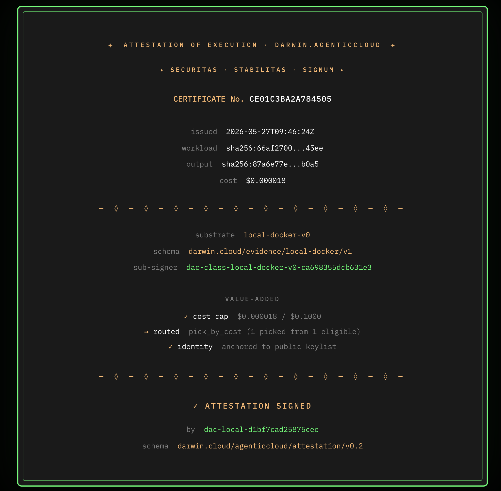

# VerifyAI for Splunk Agentic Ops

**The Security Operations Command Center for AI agent determinism.** Built for the Splunk Agentic Ops Hackathon, June 2026.

VerifyAI emits agent determinism and adversarial telemetry through OpenTelemetry into Splunk Observability Cloud. Splunk becomes the operational pane where engineering, ITOps, and compliance teams watch AI agent behavior the same way they watch infrastructure.

Track: **Observability**. Bonus claims: Splunk MCP Server.

---

## The problem

AI agents drift in production. The same prompt that worked yesterday returns different output today. Buyers cannot verify a vendor's compliance claims without seeing internals. Compliance teams cannot audit an agent the way they audit a database. SOC teams have no SIEM feed for agent failures.

Today, when an agent breaks, you find out from a customer ticket.

## The solution

Three things ship in this repo:

1. A determinism and adversarial sweep backend that scores AI agents against compliance frameworks (GLBA, SOX, CMMC, ISO 27001).
2. An OpenTelemetry exporter that pushes every sweep result into Splunk Observability Cloud as gauges and counters with proper dimensions.
3. An MCP server that lets Claude, Cursor, or any MCP client query agent posture in natural language. It is also itself a client of Splunk MCP Server. Composition is the point.

The composition matters. VerifyAI writes telemetry into Splunk on one side and reads it back through Splunk MCP Server on the other side. Same Splunk instance. Same metrics. Closes the loop.

---

## What is shipped

| Component | Status | What it does |
|---|---|---|
| `modal_app.py` | Production on Modal | 8-endpoint FastAPI backend. Runs determinism sweeps via OpenRouter. Runs DeepTeam adversarial probes. Signs Ed25519 certificates. Pushes metrics to Splunk. |
| `verifyai_mcp_server.py` | Local stdio | 8 MCP tools. Composes Modal backend with Splunk MCP Gateway. |
| Splunk dashboard | Live on Observability Cloud Free Edition | 5 panels covering determinism overall, drift, posture by framework, spread by workflow. |
| OTel exporter | Live in `_push_splunk_metrics()` and `_push_splunk_adversarial_metrics()` | Direct REST to `ingest.us1.signalfx.com/v2/datapoint`. 5-dimension cardinality. |
| Seeded data | 4 customer fixtures, 29 sweeps replayed | Echelor design partner, NCE Construction, Fifth Third Newline, smoke test. |
| Vercel frontend | `verifyai-fin.vercel.app` | Public posture certificates. Engraved gold-and-green compliance certificate aesthetic. |

---

## Architecture

```
                    +------------------------+
                    |   Consumer             |
                    |   Claude Desktop       |
                    |   MCP Inspector        |
                    +-----------+------------+
                                |
                                | MCP stdio
                                v
                    +------------------------+
                    |   VerifyAI MCP server  |
                    |   8 tools              |
                    +-----+------------+-----+
                          |            |
              HTTPS, SSE  |            |  MCP streamable HTTP
                          v            v
              +-------------------+   +------------------------+
              | VerifyAI backend  |   | Splunk MCP Gateway     |
              | on Modal          |   | 12 o11y tools          |
              |                   |   |                        |
              | run_determinism   |   | o11y_execute_signal-   |
              | run_deepteam      |   |   flow_program         |
              | DeepTeam v0.2.7   |   | o11y_search_alerts     |
              | Ed25519 sign      |   | o11y_get_metric_meta   |
              +---------+---------+   +-----------+------------+
                        |                         |
        OTel push       |                         |  SignalFlow queries
        verifyai.*      v                         v
                  +-------------------------------------------+
                  |   Splunk Observability Cloud              |
                  |                                           |
                  |   verifyai.determinism.score              |
                  |   verifyai.determinism.output_equivalence |
                  |   verifyai.determinism.semantic_equiv     |
                  |   verifyai.determinism.decision_stability |
                  |   verifyai.adversarial.pass_rate          |
                  |   verifyai.adversarial.probe_count        |
                  |   verifyai.adversarial.blocked_count      |
                  |   verifyai.adversarial.leaked_count       |
                  |                                           |
                  |   Dimensions:                             |
                  |   account, workflow, framework,           |
                  |   service, source                         |
                  +-------------------------------------------+
```

Full SVG: `architecture_diagram.png` in repo root.

---

## Observability track narrative

**Understand system behavior.** Four-metric determinism breakdown lives as Splunk SLIs, per workflow, per account. Output equivalence, semantic equivalence, decision stability, weighted overall. One pane shows every customer's agent. Discrete-decision workflows score 90 to 99 percent. Multi-step arithmetic derivations score 60 to 80 percent. The spread is the thesis made visible.

**Detect anomalies earlier.** A workflow that scored 95 percent last week and 78 percent this week is an anomaly before it is an incident. Splunk Observability Cloud time-series storage plus SignalFlow detector functions catch drift before threshold breach.

**Automate operational responses.** Metrics flow into existing Splunk detector and alert primitives. SOC playbooks attach to determinism drops the same way they attach to error-rate spikes. The schema is ordinary metric data. Nothing exotic.

**Who uses it.** Software teams shipping agents get an SRE-grade observability layer. ITOps gets compliance posture in the same pane as infrastructure. NetOps gets cross-tenant isolation telemetry, already a workflow in the seeded fixture.

---

## Use of Splunk MCP Server

VerifyAI MCP server is itself an MCP client of Splunk MCP Gateway. This is the composition pattern Splunk MCP was built for.

What happens when an analyst asks `verifyai_get_drift` in Claude Desktop:

1. VerifyAI MCP server connects to Splunk MCP Gateway over streamable HTTP.
2. Calls `o11y_execute_signalflow_program` with a SignalFlow query that filters on the workflow.
3. Parses Splunk's JSON time-series response.
4. Renders it as readable bars with timestamps and dimensions.
5. Returns to the analyst.

```
Series AAAAAAkdKVY  account=echelor-design-partner-01, framework=GLBA_Safeguards_Rule,
                    service=verifyai, workflow=echelor-ai-chat, source=replay

Data points: 1
  19:25:00  0.8446  █████████████████████████
```

The 12 discovered Splunk MCP tools (`o11y_execute_signalflow_program`, `o11y_search_alerts_or_incidents`, `o11y_get_metric_metadata`, etc.) are surfaced through `verifyai_splunk_list_tools` and `verifyai_splunk_describe_tool` for any agent that wants to compose further on top.

The 8 VerifyAI MCP tools:

| Tool | Backed by |
|---|---|
| `verifyai_list_workflows` | Modal aggregate |
| `verifyai_get_posture` | Modal aggregate |
| `verifyai_get_drift` | Splunk MCP Gateway, REST fallback |
| `verifyai_run_sweep` | Modal `run_determinism` |
| `verifyai_get_certificate` | Modal certificate endpoint |
| `verifyai_splunk_list_tools` | Splunk MCP Gateway |
| `verifyai_splunk_describe_tool` | Splunk MCP Gateway |
| `verifyai_run_adversarial_sweep` | Modal `run_deepteam`, DeepTeam v0.2.7 |

---

## Devpost submission readiness

| Check | Status | Notes |
|---|---|---|
| Splunk AI capabilities used at runtime | ✅  | Splunk MCP Server is called live in `verifyai_get_drift`. We connect to `mcp-gateway/v1`, execute SignalFlow, parse the response. Real code path, not mock. |
| Architecture diagram in repo root | ✅  | `architecture.svg` in root. Four supporting SVGs alongside it: `sequence.svg`, `mcp_composition.svg`, `metric_schema.svg`, `compliance_mapping.svg`. |
| Project new or substantially updated (after May 18, 2026) | ✅ | VerifyAI started on 5/17. The Splunk integration (OTel exporter, MCP server, Splunk MCP Gateway client, adversarial telemetry push, dashboard auto-deploy, replay pipeline) shipped during the hackathon period. Commit history backs this up. See Background section. |
| OSI license detectable | ✅  | `LICENSE` file with MIT text at repo root. GitHub About section auto-detects. |
| Repo publicly accessible | ✅  | Confirmed by opening `https://github.com/vje013/verifyai-splunk` in private browsing. |

---

## Technological implementation

**OpenTelemetry as the evidence pipeline.** Direct REST to `ingest.us1.signalfx.com/v2/datapoint` with X-SF-TOKEN auth. Two helper functions (`_push_splunk_metrics`, `_push_splunk_adversarial_metrics`) wired into the determinism and adversarial sweep endpoints. Silent skip if token is absent. Never raises. Failure to push does not break the sweep return path.

**Bidirectional MCP.** VerifyAI consumes Splunk MCP for telemetry reads. Exposes its own MCP for compliance queries. Same process, both directions.

**Ed25519 signed certificates.** Every sweep result is committed to a Modal volume ledger and counter-signed with an Ed25519 key. Cryptographic, not just logged.

**8-endpoint Modal backend, free tier compliant.** `run_determinism`, `run_deepteam`, `aggregate`, `certificate`, `generate_report`, and three supporting endpoints. Already deployed at `vje013--verifyai-backend-*.modal.run`.

**DeepTeam v0.2.7.** Open-source AI red-teaming framework. Vulnerability classes: prompt leakage, PII leakage, excessive agency, tool misuse, jailbreak, bias. Attack methods: prompt injection, roleplay, permission escalation, system override, input bypass, goal redirection. Findings map to compliance controls per framework.

**Seeded data is real, not synthetic.** Four customer fixtures, 29 historical sweeps already in the Modal volume ledger. `replay_to_splunk.py` ships them into Splunk over a configurable time window so the dashboard has shape from minute one.

---
## Design

We render compliance attestations as engraved certificates: amber serif type on a dark green field, evoking diploma and bond paper. SECURITAS · STABILITAS · SIGNUM. See `screenshots/darwin_certificate_aesthetic.png` for an example.



VerifyAI inherits that language. The visual logic ports directly into a Splunk app face.

The Splunk dashboard panel set follows the same posture-grade discipline. One number front and center. Drilldown by dimension. Trend below. Built to be read in five seconds during a standup.

The MCP server output applies the same principle inside the analyst loop. SignalFlow time-series responses render as ASCII bars with timestamps and dimensions, not raw JSON. Adversarial sweep results show pass rate per vulnerability class with proportional bars and the exact compliance controls touched. The format is the message.

Three surfaces, one aesthetic:

| Surface | Visual logic |
|---|---|
| Darwin certificates (DAC) | Engraved serif, dark green, signature line |
| Splunk dashboard  | Posture-grade panel set, one-glance reads |
| MCP tool output | Minimal density, ASCII bars, dimension labels |

Design is consistency, not decoration.
---

## Demo

```
# 1. List monitored workflows
verifyai_list_workflows

# 2. Get current posture for Echelor (design partner)
verifyai_get_posture(account="echelor-design-partner-01")

# 3. Read live drift from Splunk via MCP Gateway
verifyai_get_drift(workflow="echelor-ai-chat", window_minutes=60)

# 4. Trigger a fresh determinism sweep
verifyai_run_sweep(account_id="echelor-design-partner-01",
                  workflow_id="echelor-ai-chat",
                  framework="GLBA Safeguards Rule")

# 5. Trigger an adversarial sweep
verifyai_run_adversarial_sweep(account_id="echelor-design-partner-01",
                               workflow_id="echelor-ai-chat",
                               framework="GLBA Safeguards Rule",
                               categories="prompt_injection,pii_leakage")

# 6. See metrics in Splunk Metric Finder: verifyai.adversarial.*
# 7. Issue a signed posture certificate
verifyai_get_certificate(account="echelor-design-partner-01")
```

Demo video: see submission. Under 3 minutes.

---

## Setup

### Prerequisites

- Python 3.12
- Modal account (free tier sufficient)
- Splunk Observability Cloud Free Edition account
- OpenRouter API key (for target agent inference)
- Node.js (for MCP Inspector)

### Clone

```bash
git clone https://github.com/vje013/verifyai-splunk.git
cd verifyai-splunk
pip install modal httpx mcp
```

### Splunk credentials

1. Sign up at `splunk.com/en_us/download/observability-cloud-free-edition.html`. No card. No 14-day trial. Up to 15 hosts, free forever.
2. Settings, Access Tokens, create a token with INGEST and API capabilities.
3. Note the realm (e.g. `us1`).

### Modal backend

```bash
# Set secrets
modal secret create verifyai-secrets \
  OPENROUTER_API_KEY=sk-or-... \
  SPLUNK_ACCESS_TOKEN=... \
  SPLUNK_REALM=us1

# Deploy
modal deploy modal_app.py
```

### Seed dashboard data

```bash
python replay_to_splunk.py
python deploy_dashboard.py
```

### MCP server

```bash
pip install modelcontextprotocol httpx
python verifyai_mcp_server.py  # stdio mode

# Or wire into Claude Desktop:
# Edit ~/Library/Application Support/Claude/claude_desktop_config.json
# (see claude_desktop_config.json in repo)
```

### MCP Inspector

```bash
npx @modelcontextprotocol/inspector python3 verifyai_mcp_server.py
```

Opens at `http://localhost:6274`. All 8 tools selectable from the dropdown.

---

## File layout

```
.
├── modal_app.py                          Modal backend, 8 endpoints
├── verifyai_mcp_server.py                MCP server, 8 tools, composes Splunk MCP Gateway
├── replay_to_splunk.py                   Ships seeded ledger data into Splunk
├── deploy_dashboard.py                   Creates "Agent Determinism Posture" dashboard
├── claude_desktop_config.json            MCP wiring for Claude Desktop
├── architecture.svg                      System architecture diagram
├── sequence.svg                          Sweep lifecycle, temporal view
├── mcp_composition.svg                   VerifyAI MCP server as server and client in one process
├── screenshots/
│   ├── splunk_dashboard.png              Five-panel determinism posture dashboard
│   ├── splunk_workflow_spread.png        Multi-tenant view of all workflows in one pane
│   ├── mcp_inspector_tools.png           All 8 MCP tools surfaced through MCP Inspector
│   ├── mcp_inspector_adversarial_result.png   Live adversarial sweep result, 8 of 8 blocked
│   └── darwin_certificate_aesthetic.png  Darwin family design language reference
├── README.md                             This file
└── LICENSE                               MIT
```

---

## Roadmap

Items below are designed-for but not built in this submission. Listed for completeness because the judging criteria asks about platform integrations.

| Item | Why it is roadmap, not shipped |
|---|---|
| Cisco Deep Time Series anomaly detection | Lives in Splunk AI Toolkit on Splunk Enterprise. Hackathon submission uses Observability Cloud Free Edition only. CDTSM is a one-config-flip away. |
| Foundation-sec as adversarial generator | DeepTeam serves the same role in the shipped pipeline. Drop-in replacement when Foundation-sec API is accessible to Observability Cloud tokens. |
| AI Assistant natural language queries | Out of scope for this build. SignalFlow query strings are already programmatic, so wiring AI Assistant is a UI task. |
| Auto-pause on determinism threshold breach | Splunk detector rule plus webhook to Modal control plane. Detector primitives exist. Webhook receiver is ~50 lines. |
| Auto-page on-call via PagerDuty | Same Splunk detector mechanism. Wired through Splunk On-Call. |
| Splunk Mobile posture badge | iframe pattern is already shipping from Vercel. Splunk Mobile dashboard can host the same URL. |
| Multi-tenant Splunk org with one-customer-per-pane | Requires Splunk Cloud Platform tier and team management. Single-tenant on Free Edition for this submission. |

---

## Track and bonus alignment

| Track / Bonus | Claim |
|---|---|
| Observability | Determinism and adversarial telemetry as first-class SLIs in Splunk Observability Cloud |
| Splunk MCP Server bonus | Bidirectional MCP composition. VerifyAI MCP server is also a Splunk MCP Gateway client. |
| Grand Prize | The SOC for AI agent determinism is a new category in Splunk's portfolio |

---

## License

MIT. See `LICENSE`.

--

## Background

Built during the Splunk Agentic Ops Hackathon (May 18 - June 15, 2026). VerifyAI's determinism scoring backend pre-existed. The Splunk integration shipped during the hackathon period: OpenTelemetry exporter, dashboard auto-deployment, the MCP server, the Splunk MCP Gateway client composition, the adversarial sweep telemetry push, and the replay pipeline. The commit history reflects this.

---

## Built by

Darwin Adaptive Systems LLC. 

"SECURITAS. STABILITAS. SIGNUM."

Vladimir Edouard, CEO. Brandon Chen, COO.
